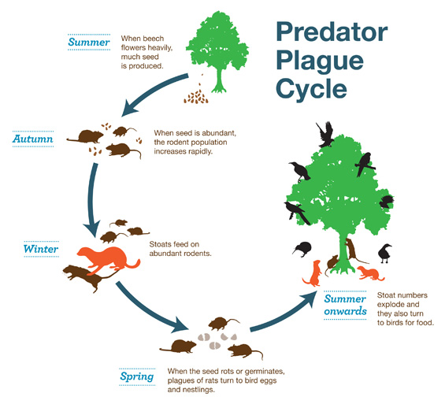

Battle for our Birds in New Zealand
========================================================
author: Barry Polley
date: 22 November 2014
transition: fade
transition-speed: slow

The beech mast
========================================================

In certain years, and in certain locations:

- Beech trees produce an extraordinary amount of seed based on unusual weather
- Rats and mice reproduce based on having lots of seed to eat
- Stoats reproduce based on having lots of rats and mice to eat
- When the seed and mice are exhausted, stoats then feed on birds
- So by controlling predator populations, birds have seed to eat

We call this explosion of beech fruiting a beech mast. We use the locations and timing of beech masts to guide pest control in order to protect bird populations.

From Dept of Conservation (NZ)
========================================================

Identifying beech mast sites
========================================================

 

Hunters Hill - beech mast in 2014

Borer Flat - no beech mast in 2014

How this would be enhanced for real use
========================================================

- Compare counts across years
- Also look at other species of beech tree
- Clean up the graphics (name the months, for example)
- Show nonviable seed counts as well as viable seed counts
- Link the sites to a map (especially helpful for non-NZers)
- Connect to an observation database rather than reading .csv extracts
